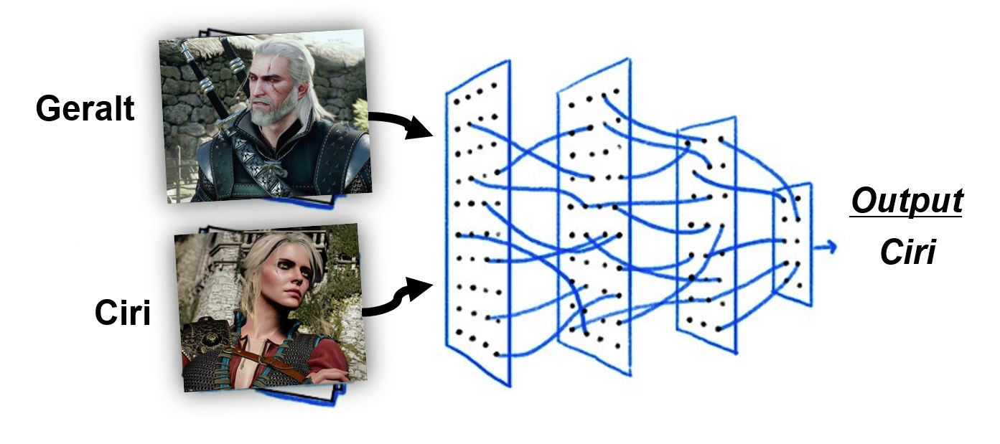

    
  </a>

  <h3 align="center">Witcher 3 - Image Classification</h3>
  

   Applying CNN for Image Classification of the characters in Witcher 3.
  

## References:
1. [Build a Deep CNN Image Classifier with ANY Images](https://www.youtube.com/watch?v=jztwpsIzEGc) 
2. [Building powerful image classification models using very little data](https://blog.keras.io/building-powerful-image-classification-models-using-very-little-data.html)
